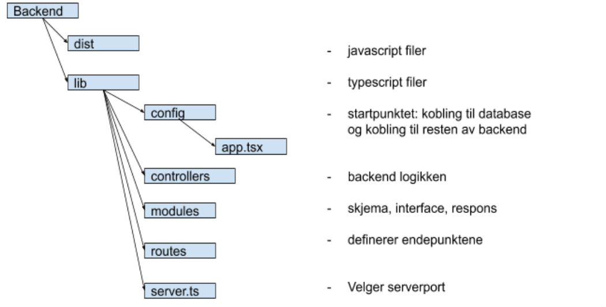

**Løsning**  
Vi har valgt å lage en nettside der man kan få opp 62 058 filmer. 
Nettsiden har en startside som presenterer temaet. Når man kommer inn på siden lastes filmene i 
tilfeldig rekkefølge og man kan navigere seg mellom sider og komme tilbake til første side med knappene 
nederst. I søkefeltet kan man søke på enkelte filmer med små og store bokstaver, eller deler av en tittel 
som lister opp alle filmer som inneholder denne strengen. Etter at søket er utført kan man sortere filmene 
etter utgivelsesår. Her har vi observert at noen filmer ikke har en verdi for utgivelsesår. Vi vurderte om 
de skulle filtreres bort, men valgt heller å ha dem der ettersom vi ikke ville fjerne noe av innholdet som 
brukeren ønsker å se. For filtrering har vi valgt ut noen av de vanligste sjangrene. Alle filmene som inneholder 
denne sjangeren blir listet opp ved filtreringen. Dersom man ønsker mer informasjon om en film kan dette sees ved 
å trykke på “info”-knappen for hver film. På nettsiden har man også mulighet til å up- og down vote filmene. Dette 
blir lagret i databasen, så ratingen som står på siden er sammenlagt fra alle brukerne. Man har kun muligheten til å
up- eller down vote en film én gang.

**Backend** 
Da vi skulle velge backend teknologi tok vi utgangspunkt i det medlemmene av gruppa hadde vært innom i Programvareutvikling. Dermed sto vi mellom SQLite og MongoDB. 
Etter å ha undersøkt dette fant vi ut at MongoDB ville være mest hensiktsmessig for gruppen. Fordi  MongoDB er en database som ikke har like mange begrensninger som MySQL. Det gjelder begrensninger som omhandler databaseskjema og datamodellering som kan senke utviklingen. Dette er en av grunnene til at gruppen valgte å bruke mongoDB, samt. at databasen er skalerbar og kan dermed ta i mot datasett, fremfor at man må legge inn data manuelt. 

**API** 
Ved valg av API gjorde vi en vurdering der vi landet på REST api. Hovedforskjellen er et GraphQL bare har et endepunkt, mens REST api har flere. Med GraphQL kan man spesifisere hvilke felt med informasjon man vil hente fra databasen. REST api har flere endepunkter. RESTapi er den mest brukte i dag, dette anså vi som en stor fordel ettersom det er god dokumentasjon og gode guider på hvordan vi kan sette det opp. Det er essensielt for oss ettersom ingen har satt opp en API kobling før. Vi implementerte RESTapi sammen med node.js, express og mongoose. 
Vi har implementert tre endepunkter. app.get(“/api/movie”), put(api/upVote/:title) og put(api/downVote/:title). Det var hensiktsmessig med et get-punkt ettersom filtrering og sortering skulle bli gjort på søkeresultatet. Da var det enkelt å utføre filtrering/sortering dersom det var et search-filter, og ellers returnere all dataen i databasen. 

**Typescript og React**  

**Redux**  
Vi valgte å benytte redux for state management. Til mindre prosjekter var det flere guider og videoer som anbefalte MobX, til tross for dette valgte vi Redux. Vi ønsket å lære Redux ettersom det er mye brukt og for oss er hensikten med faget å få størst mulig læringsutbytte. I tillegg er Redux godt dokumentert som gjør det enklere å lære seg det. Redux viste seg å være et nyttig verktøy, men det var komplisert og komplekst å forstå i starten.
Redux lagrer staten til et objekt og gjør det mulig å aksessere denne uavhengig av hvor staten ble endret. Dette er mulig ettersom alle endringer blir lagret som action som vi har i “..Action/Actions.tsx”. Hver action som er en mulig endring for en hendelse er samlet i en egen reducer i “..Reducer/…”. Reduceren spesifiserer hvilke endringer som kan inntreffe, og gjør staten forutsigbar som er en viktig fordel med Redux. For å aksessere action sin verdi er det koblet inn en store der man kan hente verdien og endre verdien til action.

**Tredjepartskomponenter**  
Vi har tatt i brukt https://materializecss.com/ som tredjepartskomponent for at layoutet til siden skulle bli enklere å utforme. Det har hjulpet mye for at frontend-utseendet ikke tok for mye tid å utforme.

**Testing**  
End-2-End 
I vårt prosjekt har vi brukt cypress for å vise at vi behersker grunnleggende automatisert end-2-end testing. Vi har laget tester som skal sjekke om søket brukeren gjør er gyldig, og om søkefunksjonen dukker opp på webapplikasjonen sin side. Automatiserte cypress tester som interagerer med siden sammenlignet med mennesker som interagerer med siden er veldig likt. Dette er grunnen til at vi har valgt nettopp denne løsningen. 
For å kjøre disse testene må du…. 
x 
(Screen av approved tester) 
x 

Enhetstesting (Jest og snapshot og Mocha) 
Gruppen har skrevet ulike former for enhetstester, hvor vi da har skrevet snapshots og brukt jest. Vi har skrevet enhetstester som tester et komponent for å unngå 
For å kjøre disse testene så må du... 
x 
(screen av gjennomført test) 
x 

**Git** 
Vi har tatt i bruk git gjennom hele prosjektet. Prosjektplanleggingen startet med å lage en liten backlog med brukerhistoriene som skulle inngå for filtrering, søking og lagring. Deretter la vi opp issues på git. Gjennom prosjektet har vi lagt til og oppdatert issuene som er på gitLab. Gruppen har brukt issue mye mer aktivt under dette prosjektet enn forrige. Det har gjort det enklere å følge opp hverandres arbeid.
Samarbeidet under prosjektet har fungert bra ettersom 2 personer satt seg inn i context og 1 person inn i backend og koblingene. Det ble brukt mye tid på å opparbeide seg kunnskap før logikken kunne bli implementert. Etter at begge parter hadde fått en god forståelse for sin del satt vi oss sammen og koblet sammen de forskjellige delene. Dette førte til at vi fikk til all logikken, og kunne lære av hverandre.

