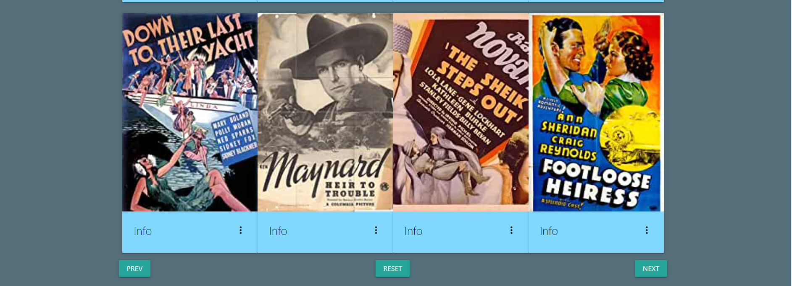

# Movie Explorer 

 
Movie Explorer er en nettside hvor brukeren kan søke etter 
filmer i en database med 62 058 forskjellige filmer. 
Nettsiden har en startside som presenterer temaet. 
Search-knappen tar brukeren videre til hovedsiden hvor 
han/hun får opp forskjellige filmer hentet fra databasen. 
Brukeren kan navigere seg gjennom flere filmer ved å bruke knappene “next” og 
“prev” nederst på siden. 

 

 

 
I søkefeltet kan brukeren søke på enkelte filmer med små og store bokstaver, 
eller deler av en tittel som vil liste opp alle filmer som inneholder denne 
strengen. Etter at søket er utført kan brukeren sortere filmene etter utgivelsesår. 
Her har vi observert at noen filmer ikke har en verdi for utgivelsesår. 
Vi vurderte om de skulle filtreres bort, men valgt heller å ha dem der 
ettersom vi ikke ville fjerne noe av innholdet som brukeren ønsker å se. 
Brukeren kan filtrere filmene etter sjangere.

<lu />

 Ved å trykke på info-knappen blir mer informasjon om filmen vist.
 Her kan brukeren også up- og down-vote filmene. Rangeringen 
 blir lagret i databasen, dermed er verdien den sammenlagte 
 rangeringen av alle brukere. Brukeren har kun muligheten til å up- 
 eller down-vote en film én gang.

 

*Her er det søkt på Harry Potter og sortert på utgivelsesår:*

## Oppsett av prosjektet 
klon prosjektet med SSH/HTTP nøkkel  
 
Gå inn i 
### `prosjekt-3->my-app`

I prosjekt directorien skriver du
### `npm install`
Man må kjøre backend og frontend separat  
#### Backend: 
### `cd backend`
### `npm run dev`
#### Frontend:
### `cd my-app`
### `npm start`

# Backend
Da vi skulle velge backend teknologi tok vi utgangspunkt i det medlemmene av gruppa hadde vært innom i Programvareutvikling. Dermed sto vi mellom SQLite og MongoDB. 
Etter å ha undersøkt dette fant vi ut at MongoDB ville være mest hensiktsmessig for gruppen. Fordi  MongoDB er en database som ikke har like mange begrensninger som MySQL. Det gjelder begrensninger som omhandler databaseskjema og datamodellering som kan senke utviklingen. Dette er en av grunnene til at gruppen valgte å bruke mongoDB, samt at databasen er skalerbar og kan dermed ta i mot datasett, fremfor at man må legge inn data manuelt. 

## API 
Ved valg av API gjorde vi en vurdering der vi landet på REST api. Hovedforskjellen er et GraphQL bare har et endepunkt, mens REST api har flere. Med GraphQL kan man spesifisere hvilke felt med informasjon man vil hente fra databasen. REST api har flere endepunkter. RESTapi er den mest brukte i dag, dette anså vi som en stor fordel ettersom det er god dokumentasjon og gode guider på hvordan vi kan sette det opp. Det er essensielt for oss ettersom ingen har satt opp en API kobling før. Vi implementerte RESTapi sammen med node.js, express og mongoose. 
Vi har implementert tre endepunkter. app.get(“/api/movie”), put(api/upVote/:title) og put(api/downVote/:title). Det var hensiktsmessig med et get-punkt ettersom filtrering og sortering skulle bli gjort på søkeresultatet. Da var det enkelt å utføre filtrering/sortering dersom det var et search-filter, og ellers returnere all dataen i databasen. 

# Tekonologier  

### React
Prosjektet er basert på React og har blitt initialisert med create-react-app.

### Typescript 
 Typescript hjalp oss underveis i prosjektet med å skire kodekaviteten og gjorde koden mer forstårlig. 

### Redux  
Vi valgte å benytte redux for state management. Til mindre prosjekter var det flere guider og videoer som anbefalte MobX, til tross for dette valgte vi Redux. Vi ønsket å lære Redux ettersom det er mye brukt og for oss er hensikten med faget å få størst mulig læringsutbytte. I tillegg er Redux godt dokumentert som gjør det enklere å lære seg det. Redux viste seg å være et nyttig verktøy, men det var komplisert og komplekst å forstå i starten.
Redux lagrer staten til et objekt og gjør det mulig å aksessere denne uavhengig av hvor staten ble endret. Dette er mulig ettersom alle endringer blir lagret som action som vi har i “..Action/Actions.tsx”. Hver action som er en mulig endring for en hendelse er samlet i en egen reducer i “..Reducer/…”. Reduceren spesifiserer hvilke endringer som kan inntreffe, og gjør staten forutsigbar som er en viktig fordel med Redux. For å aksessere action sin verdi er det koblet inn en store der man kan hente verdien og endre verdien til action.

### Materialize  
Vi har tatt i brukt https://materializecss.com/ som tredjepartskomponent for at layoutet til siden skulle bli enklere å utforme. Det har hjulpet mye for at frontend-utseendet ikke tok for mye tid å utforme.

# Testing  
### End-2-End
I vårt prosjekt har vi brukt cypress for å vise at vi behersker grunnleggende automatisert end-2-end testing. Vi har laget tester som skal teste ulike situasjoner en bruker kan havne i. Disse testene er beskrevet i bildene under. 
Hensikten med disse cypresstestene er at de fungerer på samme måte som et menneske som interagerer med siden, og derfor er det grunnen til at vi valgte denne løsningen. 

For å kjøre disse testene må du…. 
x 
(Screen av approved tester) 
x 

### Enhetstesting (Jest og snapshot og Mocha) 
Gruppen har skrevet ulike former for enhetstester, hvor vi da har skrevet snapshots og brukt jest. Vi har skrevet enhetstester som tester et komponent for å unngå 
For å kjøre disse testene så må du... 
x 
[Screenshot 2020-11-04 at 07.55.22](url)
 
x 

# Git 
Vi har tatt i bruk git gjennom hele prosjektet. Prosjektplanleggingen startet med å lage en liten backlog med brukerhistoriene som skulle inngå for filtrering, søking og lagring. Deretter la vi opp issues på git. Gjennom prosjektet har vi lagt til og oppdatert issuene som er på gitLab. Gruppen har brukt issue mye mer aktivt under dette prosjektet enn forrige. Det har gjort det enklere å følge opp hverandres arbeid.
Samarbeidet under prosjektet har fungert bra ettersom 2 personer satt seg inn i context og 1 person inn i backend og koblingene. Det ble brukt mye tid på å opparbeide seg kunnskap før logikken kunne bli implementert. Etter at begge parter hadde fått en god forståelse for sin del satt vi oss sammen og koblet sammen de forskjellige delene. Dette førte til at vi fikk til all logikken, og kunne lære av hverandre.

# Kilder

